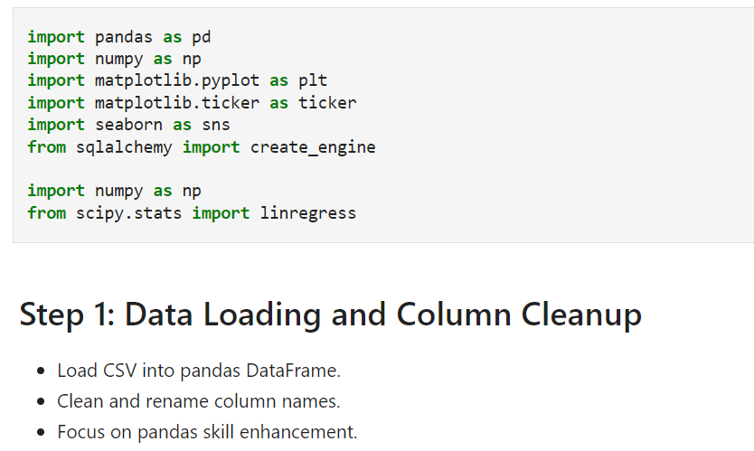
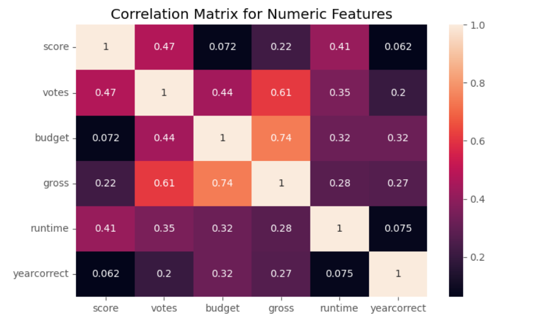
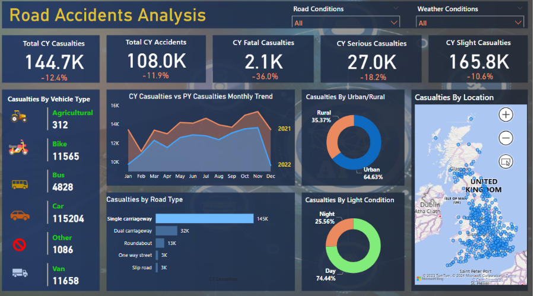
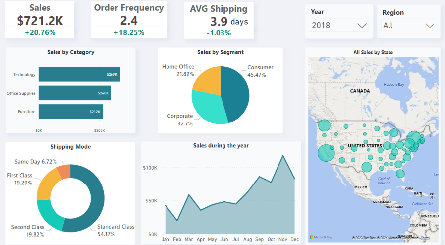
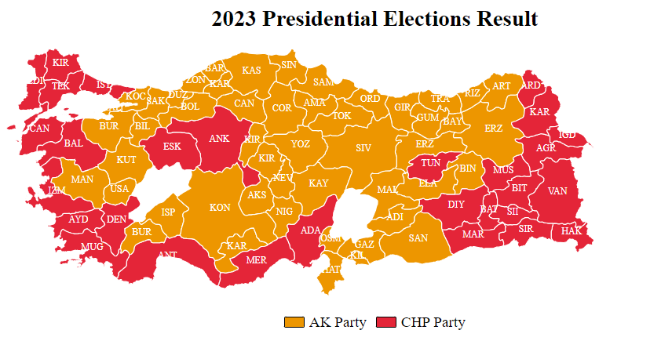

# Data Analysis Daily 

Welcome to my GitHub repository dedicated to Data Analysis Projects! This is a space where I explore and apply data analysis concepts daily, aiming for continual learning and mastery. Below is a quick overview of each project, highlighting its purpose and the main skills or tools used. For in-depth details, please check the project folders.

**Challenge_1 Retail Analysis** 📊💻📈

I used a randomly generated dataset with the aim to get hands-on exposure to the data analysis workflow. 
This project involved cleaning and analyzing retail data using Python (**Pandas, NumPy, SciPy, SQLAlchemy**)
and SQL, focusing on inventory management and sales trend analysis. Skills developed include data preprocessing, 
SQL querying for advanced analysis, and statistical methods like **linear regression** for interpreting sales trends and optimizing inventory.

  

**Challenge_2 Correlation Python** 🔍📉🔢

My aim in this project was to learn and practice  correlation. I cleaned missing data, duplicates, data types
and used **scatterplots** to visualize correlation between numerical data also created a **heatmap** for a correlation
matrix. I further studied correlation significance by learning how to use the **t-test**, specifically understanding **t-values** and **p-values**.

**Challenge_3 Road Accidents PowerBI** 📚🗂️🧮 

The aim of this project was to gain practical knowledge of **Power BI**. Part of my work included data cleansing,
such as replacing faulty values, etc. I also created a **Calendar** Table and connected it to the accident records with 
a foreign key, which helped in creating dynamic data visualizations. I really enjoyed the whole process of creating calculations through **measures** and using them to create interactive dashboards.

**Challenge_4 Global Sales PowerBI(Sales Performance Dashboard)** 📈🔍📉

Using a dataset from Kaggle, I conducted a Super-Store data analysis, aiming to adhere to best practices. The process began with an initial data cleanup, followed by a comprehensive **Exploratory Data Analysis** (EDA) to identify patterns, correlations, and anomalies, performed on **Jupyter Notebook**. After saving the cleaned data locally, I moved to **Power BI**, where I performed different **DAX** calculations and **measures** to calculate various KPIs as per the stakeholders' requirements. The project was finalized with the creation of an interactive dashboard.

**Challenge_5 Turkish Elections Result Analysis 📊💻📈**
[Turkish Elections Result Analysis](https://alerdo.github.io/data-story-telling-the-times/)

In this project, I began with data collection from Statista and Turkish election sites, followed by cleaning and analysis using **Python** and **Pandas** in Jupyter Notebook. I then merged this data with a **GeoJSON** file for mapping. Using the **D3** library, I created an interactive, color-coded map and several charts, focusing on insightful data presentation and user engagement.

### Technologies and Tools

Throughout these projects, I utilize a range of technologies and tools, such as:
- PowerBI, Jupyter Notebook
- Python
- SQL
- Pandas
- NumPy
- Matplotlib
- Seaborn
- Sqlalchemy
- SciPy
- JavaScript(D3)

  

### Connect with Me

Feel free to reach out for collaboration, feedback, or any inquiries:

- 🔗 [LinkedIn](https://www.linkedin.com/in/alerdo-ballabani-450a85283/)
- 🖥️ [Portfolio](https://alerdo-ballabani.co.uk/)
- 📱 Mobile: 07555714402
- 📧 [Email](mailto:alerdo23@gmail.com)

I'm always eager to connect with fellow data enthusiasts and professionals.
Feed back would be much appreciated.

